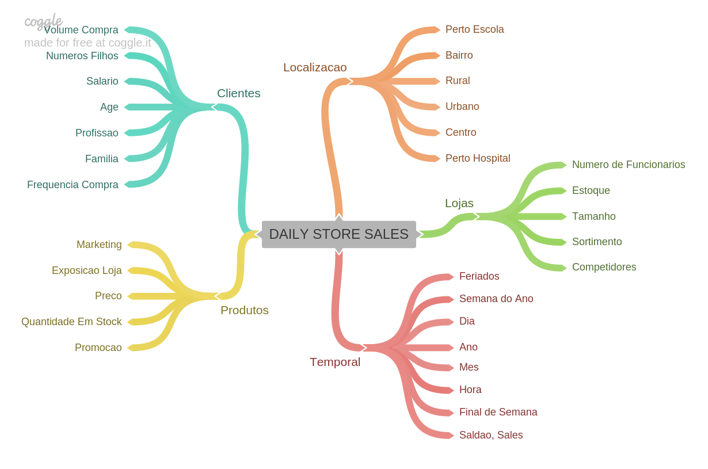
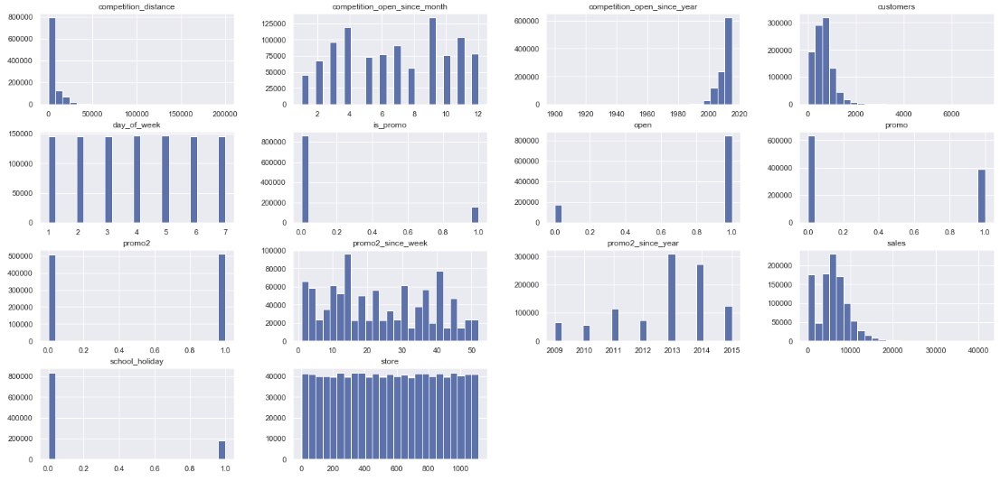
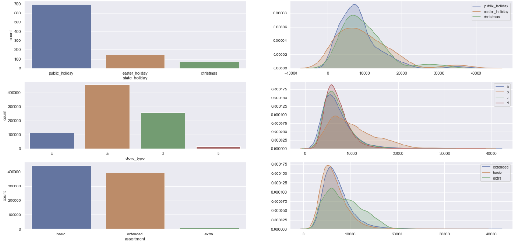
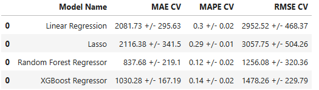
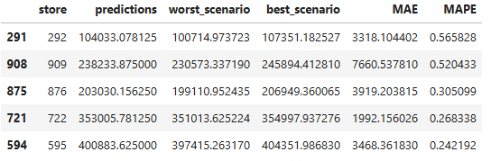
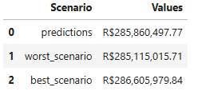
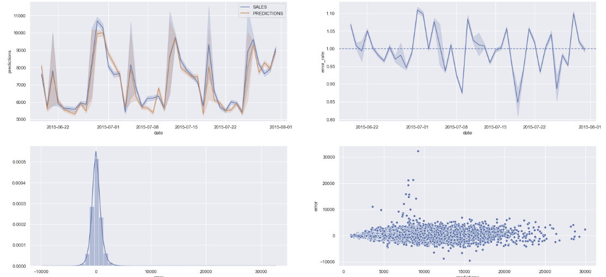

# ROSSMANN Stores Sales Predictions

## Summary
1. Context
2. Challenge
3. Solution Development
4. Conclusion & Demo
5. Next Steps

# **Context**
- Rossmann is a pharmaceutical company in Europe, with over 1,115 stores spread throughout Europe.
- At the end of each month, a meeting is held with all store managers to discuss the results achieved and not achieved.
- The CFO asked all managers to provide a Sales Forecast for the next 6 weeks for each store.

# **Challenge**
## Problem
- In fact, the CFO is having difficulty defining the renovation budget for each store.

## Causes
- Current sales forecast shows a lot of divergence.
- The sales forecast process is based on past experiences.
- All sales forecasts are done manually by Rossmann's 1,115 stores.
- Sales visualization is limited to the computer.

## Solution
- Use Machine Learning to perform Sales Forecasts for All Stores.
- Sales Predictions can be viewed on a Smartphone.

# **Solution Development**
1. Data Description
2. Descriptive Statistics
3. Hypothesis Mind Map

4. Exploratory Analysis Hypotheses
   - Stores with larger assortments should sell more.
   - Stores with closer competitors should sell less.
   - Stores with competitors that have been around for longer should sell more.
   - Stores with promotions running for longer should sell more.
   - Stores with more days of promotions should sell more.
   - Stores with more consecutive promotions should sell more.
   - Stores open during the Christmas holidays should sell more.
   - Stores should sell more throughout the years.
   - Stores should sell more in the second half of the year.
   - Stores should sell more after the 10th of each month.
   - Stores should sell less on weekends.
   - Stores should sell less during school holidays. 5. EXPLORATORY DATA ANALYSIS
   - Response Variables
   - Numerical Variables
   - 
   - Categorical Variables
   - 
   - Hypothesis Validation
   - Hypothesis Summary
6. Multivariate Analysis
   - Numerical Attributes
   - Categorical Attributes
7. MACHINE LEARNING MODELLING
   - Model Performance Comparison
   - 

# **Conclusion & Demonstration**
## ERROR TRANSLATION AND INTERPRETATION
### Business Performance

### Total Performance

### Machine Learning Performance

# **Next Steps**
1. Business User Model Workshop.
2. Collect Usability Feedback.
3. Increase Model Accuracy by 10%.